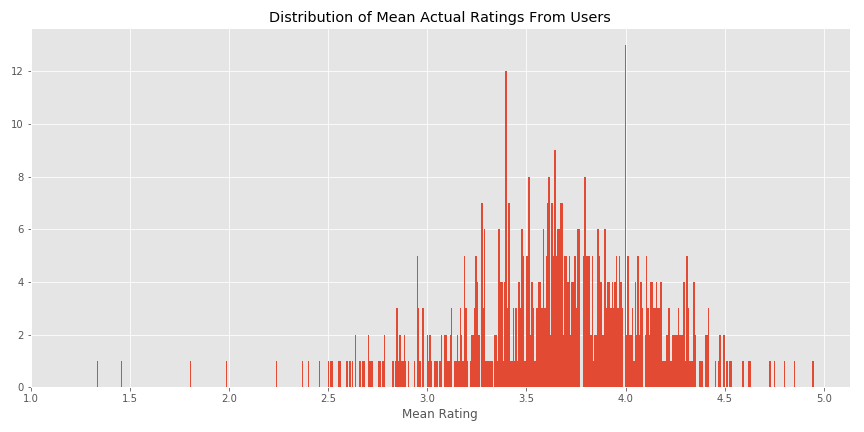
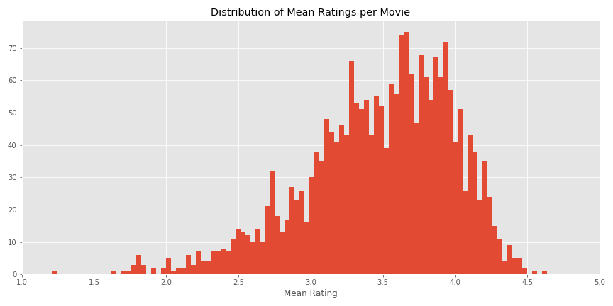
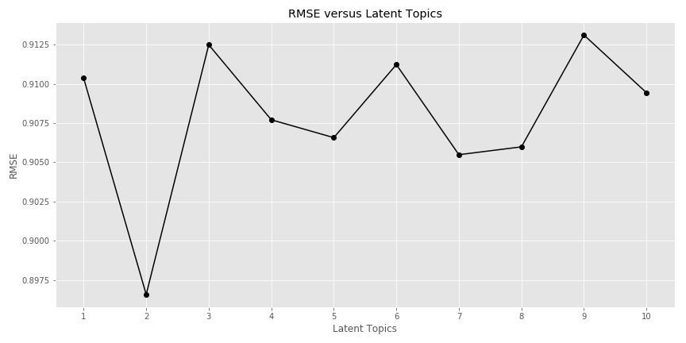

# Recommender Case Study on MovieLens dataset for Movies-Legit

### by:
- Nicolas Jacobsohn
- Greg Noble
- Peter Schmeiser
- Joe Tustin

## Table of Contents
1. [Introduction](#Introduction)
2. [Description of the Dataset](#DescOfData)
3. [Starting Baseline](#StartingBaseline)
4. [New Proposed Model](#NewProposedModel)
5. [Plan of Implementation](#PlanOfImplementation)

## Introduction:
Can we beat the predictive ability of a mean of means in rating this movie dataset.  What is a mean of means?   For all users over all movies, you calculate a global average for all movie ratings on a scale of 0 to five.  Guess what: the average global rating is 3.54.  Next, you average over each user and then you average over each movie.  These user and movie averages are then averaged with the global mean for each data point in the users vs movie data matrix. For example, User1 has a rating average of 2.55 and movie1 ("Toy Story") has an average rating of 3.87.  So, our matrix element (1,1) would be the mean of these three values, 3.32.  However, it would be more meaningful to fill in values giving more weight to users who show similar trends to the user of interest and to give more weight to movie columns that are similar to the movie column of interest.  This new method of averaging takes into account similarity.

## Description of Dataset 

The small version of the MovieLens dataset consists of 100,004 ratings ranging from 0 to 5.  There are 9125 movies in the dataset and 671 unique users.  To be a legitimate user, the user must have rated at least 20 movies.

## Starting Baseline:
When you run the existing mean of means recommender model, you get a RMSE (Root Mean Square Error) 1.0173  What does this test metric mean?  For existing recommendations that we have,  the reconstructed recommendation model would be off by a value of 1 on a scale of 0-5 on average for each recommendation that we have in our dataset.  Not that great!!
Let's do better.

## New Proposed Model:
Alternating Least Square (ALS) is a matrix factorization algorithm and it runs itself in a parallel fashion. ALS is implemented in Apache Spark ML and built for a larges-scale collaborative filtering problems. ALS is doing a pretty good job at solving scalability and sparseness of the Ratings data, and it’s simple and scales well to very large datasets.
Some high-level ideas behind ALS are:
ALS minimizes two loss functions alternatively; It first holds user matrix fixed and runs gradient descent with item matrix; then it holds movie matrix fixed and runs gradient descent with user matrix

Its scalability: ALS runs its gradient descent in parallel across multiple partitions of the underlying training data from a cluster of machines.  It is shown to be the best in the table below for various modeling techniques

**Table 1**: Modeling Methods and results

| Movielens(100k)	| RMSE |	MAE	| Time |
|---:|-----------:|:-----------------------|----:|
|MeanOfMeans|1.0173|0.837|0:00:03|
|SVD|	0.934	|0.737|	0:00:11|
|SVD++|	0.92|	0.722|	0:09:03|
|NMF	|0.963|	0.758	|0:00:15|
|Slope One|	0.946|	0.743	|0:00:08|
|k-NN|	0.98|	0.774	|0:00:10|
|Centered k-NN	|0.951|	0.749	|0:00:10|
|k-NN Baseline	|0.931|	0.733|	0:00:12|
|Co-Clustering	|0.963|	0.753|	0:00:03|
|Baseline|	0.944|	0.748	|0:00:01|
|Random	|1.514|	1.215	|0:00:01|
|ALS| 0.896|0.696| 0:00:04|

With the new, proposed Alternating Least Squares model, we see an improvement of 12% over the mean of means model.

ALS Parameters:

    2 Latent Topics 
    10 Iterations
    0.1 Lambda 
    0.01 Learning Rate

## Results: Example use of recommender

If we look at a random user, let's say User #7:
Three of their highest rated movies(rating of 5) from this user were:
1. Braveheart
2. Stars Wars Episode V,
3. Beavis and Butt-Head Do America

Our new model recommends to watch these three movies:
1. Innocence
2. Mifune's Last Song
3. Maelström

As another double check on the value of our recommender:
We averaged the new ratings for all movies and the five highest movies were:

1. The Best Years of Our Lives (1946)
Mean Rating: 4.64
2. Inherit the Wind (1960)
Mean Rating: 4.54
3. The Godfather (1972)
Mean Rating: 4.49
4. The Shawshank Redemption (1994)
Mean Rating: 4.49
5. Tom Jones (1963)
Mean Rating: 4.46

## Proposed Plan of Implementation:
Let's start slow and not break anything.  Let's keep the existing model in production.  We will split 5% of our users over to the new model.  We will track usage rates over time.  Our new model will have to match or beat the current model's return user usage rate.  Once our new model has over 300,000 hits, we will start to linearly scale up the number of users using the new model over a six month time frame to see if we can successfully scale up without crashing the site.
